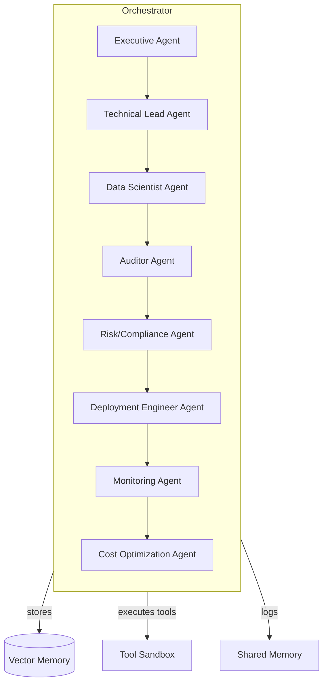

# Creating-autonomous-AI-agents

A collection of prototype autonomous AI agents implemented in Python.

## 🧠 AI Technical Project Manager Agent

This agent is designed to support engineering managers and technical program managers by analyzing project data, forecasting risks, and suggesting mitigations. It demonstrates key features:

- Convert Jira tickets into technical dependency graphs
- Identify bottlenecks using graph centrality
- Predict sprint slippage based on velocity history
- Summarize risk exposure from ticket labels
- Suggest tiered mitigation plans based on risk frequency
- (Optional) integrate with GitHub commit velocity
- (Optional) detect burndown anomalies

### 🛠 Getting Started

Install dependencies:

```bash
pip install -r requirements.txt
```

Run the sample script to see agent stubs in action:

```bash
python run_agent.py
```

Additional agents live under their own packages.  For example, the anime
selector can be invoked via its CLI and supports a live MyAnimeList search if
``USE_JIKAN`` is set.

```bash
python -m ai_anime_agent.cli "naruto"
```

The safety agent exposes a simple API for locating offenders near an address.  A
geocoding backend using ``geopy``/Nominatim is included and can be used like:

```python
from ai_safety_agent.agent import SafetyAgent
agent = SafetyAgent(registry_data=[{'latitude': 40,'longitude': -75}])
# will raise if geocoding fails
coords = agent.geocode('1600 Pennsylvania Ave NW, Washington, DC')
print(agent.offenders_within_radius(coords, 10))
```

### � Installation

Make the repository importable and install dependencies:

```bash
git clone <repo-url>
cd Creating-autonomous-AI-agents
python -m pip install -e .           # editable install
pip install -r requirements.txt      # runtime deps
pip install -r requirements-dev.txt  # developer tools
```

You can also run the tests directly with `PYTHONPATH=.` if you prefer a lightweight check.

### ⚙️ Development & CI

* **Pre‑commit hooks** are configured via `.pre-commit-config.yaml` (black, ruff, mypy).
  Run `pre-commit install` after cloning.
* **GitHub Actions** workflow (`.github/workflows/ci.yml`) runs on push/pull requests:
  - installs the package in editable mode
  - lints with black/ruff/mypy
  - runs `pytest --cov` and uploads coverage to Codecov (set `CODECOV_TOKEN` secret)

### �📁 Project Structure

```
/ai_tpm_agent
    agent.py        # core agent implementation
    __init__.py
run_agent.py        # example entrypoint
requirements.txt
```

Future work includes wiring up real Jira/GitHub clients, enhancing prediction models, and building a user interface.

## 🤖 Multi-Agent System: Data Scientist + Reviewer + Auditor

A demonstration of agent orchestration where:

1. **Data Scientist** builds a predictive model
2. **Auditor** checks for leakage, bias, and reviews methodology
3. **Business Reviewer** ensures alignment with KPIs

This showcases multi-role reasoning and a governance mindset – excellent material for a portfolio.

### 🗂 Structure

```
/ai_multi_agent            # earlier template multi-agent system
    agents.py
    orchestrator.py
/ai_org_agent              # new apex organization system
    agents.py            # specialist agent classes
    orchestrator.py      # meta-orchestrator
/tests
    test_multi_agent.py
    test_org_agent.py    # verifies high-level flow
```

### 🚀 Apex Multi-Agent Organization

An ambitious reference implementation of a self-improving analytics firm. It includes:

* **Executive, Technical Lead, Data Scientist, Auditor, Risk, Deployment, Monitoring, Cost** agents
* A coordinating **Orchestrator** with memory and simple task decomposition
* **Vector memory** store and retrieval example
* **Tool execution** API (run python snippets)
* **Self-critique** loop stub
* **Monitoring agent** with drift detection logic
* Skeleton for future extensions: simulation environment, CI/CD automation, cost optimization rules, etc.

#### 📐 Architecture Diagram

### 🧩 Command-Line Interface & Container

A simple CLI (`cli.py`) allows anyone to run the orchestrator or simulate drift:

```bash
python cli.py "increase revenue"
python cli.py "" --simulate
```

A `Dockerfile` packages the project; after building you can run the same CLI inside a container:

```bash
docker build -t ai-org-agent .
docker run --rm ai-org-agent --help
```

The container is convenient for demos or sharing with others.

#### 📐 Architecture Diagram


```
Run the short smoke test:

```bash
PYTHONPATH=. pytest tests/test_org_agent.py -q
```

### 🛡️ Public Safety Agent Example

A very simple agent illustrating how one might check a publicly-accessible
registry of offenders (sex offender, violent offender, etc.) and determine
whether any entries fall within a given radius of an address. **Important:**
this example is purely conceptual; actual deployments must be legal in your
jurisdiction and use only official data sources.

Structure:

```
/ai_safety_agent
    agent.py        # safety-check class with geocoding stub
/ai_anime_agent
    agent.py        # searchable catalogue of anime videos
    cli.py          # terminal interface for searching
/tests
    test_safety_agent.py
    test_anime_agent.py
```

### 🎥 Anime Selection Agent

A playful terminal agent that lets you type a search term, presents matching
anime titles from a hard‑coded catalogue, and prompts you to pick one.  In a
real implementation the catalogue would be fetched from an API (e.g. AniList,
MyAnimeList) and the CLI could open the selected URL in a browser.

### 📊 Market Ops Commander (MVP skeleton)

A starting point for the autonomous market/ops agent described earlier.  The
`market_ops` package is structured with modular subcomponents:

* `/market_ops/data` – data fetchers with optional real APIs.  `finance.py`
  uses `yfinance`; `social.py` will call Twitter via `tweepy` when a
  bearer token is provided, otherwise it returns random sentiment; `news.py`
  parses RSS feeds using `requests`.
* `/ai_org_agent` – orchestrator now includes a safer tool executor using AST
  parsing and a basic self‑critique mechanism.  Unit tests verify that malicious
  code cannot be run and that the critique logic triggers on short or error
  outputs.
* `/ai_safety_agent` – geocoding implementation using `geopy`/Nominatim, with
  fallback errors.  Querying an address now works end‑to‑end and is covered by
  tests.
* `/ai_anime_agent` – search can optionally hit the public Jikan API when
  `USE_JIKAN` is set, falling back to a local catalogue.  The CLI respects this
  and tests simulate both modes.
* `/market_ops/models` – scoring logic with heuristics and an optional
  LLM/`openai` call when `USE_LLM` is set.  A simple reinforcement update
  module adjusts strategy weights over time.
* `/market_ops/db.py` – SQLite persistence for logs and strategy state, with
  helpers to save/load.
* `/market_ops/notifications.py` – real Slack webhook and SMTP mail support
  (configured via environment variables) with fallbacks to printing.
* `/market_ops/scheduler.py` – `schedule`‑based periodic runner, now
  testable and configurable down to seconds.
* `/market_ops/api.py` – FastAPI service exposing `/health`, `/metrics`,
  `/status`, `/run`, `/strategy`, `/experiment`, and `/dashboard` endpoints.
  Mutating endpoints (`/run`, `/experiment`) can be protected with
  `MARKET_OPS_API_KEY`.
* `/market_ops/cli.py` – command‑line interface allowing one‑off runs,
  scheduling, and API launch.
* `/market_ops/config.py` – small helpers for reading environment variables.
* `/market_ops/orchestrator.py` – `MarketOpsCommander` ties components,
  optionally persists strategy to a database, and includes a run loop.
* `/market_ops/tests` – comprehensive unit tests for all new behavior,
  including CLI, database persistence, social fetcher mocking, and
  notifications.

The orchestrator now imports the stub fetchers and scoring function so the
`run_loop` method executes through a realistic sequence.

#### Getting started

```bash
python -m pip install -e .
pytest market_ops/tests -q
```

You can exercise individual components:

```python
from market_ops.orchestrator import MarketOpsCommander
moc = MarketOpsCommander()
moc.run_loop()
```

To run the scheduler:

```bash
python -c "from market_ops.scheduler import run_periodic; run_periodic(5)"
```

To start the API server (after installing uvicorn):

```bash
uvicorn market_ops.api:app --reload
```

When `MARKET_OPS_API_KEY` is set, include it for protected endpoints:

```bash
curl -X POST http://127.0.0.1:8000/run -H "X-API-Key: $MARKET_OPS_API_KEY"
```

A command‑line helper is also provided; you can run the orchestrator, print
status, or spin up the scheduler without importing Python directly:

```bash
python -m market_ops.cli run            # one-shot loop
python -m market_ops.cli status         # show logs/strategy
python -m market_ops.cli schedule --interval 5
python -m market_ops.cli api            # launch FastAPI via uvicorn
```

### 📦 Container & Deployment

The project includes a `Dockerfile` and optional orchestration manifests.

Build the image locally:

```bash
# from repo root
docker build -t creating-autonomous-ai-agents:market-ops .
```

Run with `docker run` exposing port 8000:

```bash
docker run --rm -p 8000:8000 \
  -e "TWITTER_BEARER_TOKEN=" \
  -e "USE_LLM=0" \
  creating-autonomous-ai-agents:market-ops
```

Or use the provided `docker-compose.yml`:

```bash
docker-compose up --build
```

You can copy `.env.example` to `.env` and fill in values before running.

A Kubernetes deployment manifest is also available under `k8s/deployment.yaml`.
Apply it with:

```bash
kubectl apply -f k8s/deployment.yaml
```

Adjust the environment variables or mount a volume for `/app/data` to
persist the SQLite database and any other state.  The container’s default
entrypoint runs `market_ops.cli api`, but you can override it at runtime if
you need a one‑off invocation (`docker run … python -m market_ops.cli run`).

Environment variables that influence behavior include:

* `TWITTER_BEARER_TOKEN` – if set, real Twitter sentiment will be fetched.
* `USE_LLM` / `OPENAI_API_KEY` – when enabled, scoring delegates to an OpenAI
  ChatCompletion call.  Requires network connectivity and a valid key.
* `SLACK_WEBHOOK_URL` – incoming webhook URL for Slack notifications.
* `SMTP_SERVER`, `SMTP_PORT`, `SMTP_USER`, `SMTP_PASSWORD` – SMTP details for
  email alerts.
* `MLFLOW_TRACKING_URI` – if set and `mlflow` is installed, experiments will be
  logged to the given tracking server.
* `MARKET_OPS_API_KEY` – enables API-key protection for mutating endpoints.
* `MARKET_OPS_DB_PATH` – sqlite path used by the API/orchestrator.

The application also uses the standard Python `logging` module.  Logs are
printed at INFO level and, when a database path is provided, are stored in the
`logs` table as events.

The system is designed for rapid extension: hook in real data sources, plug in
LangChain/LLM reasoning for scoring, persist results in Postgres or a vector
DB, and add notification channels.

Feel free to explore or extend the agent for your own use cases!

### 🚀 Release Automation

Tag-based releases are automated by `.github/workflows/release.yml`:

* Builds source/wheel artifacts using `python -m build`
* Optionally publishes to PyPI when `PYPI_API_TOKEN` is configured
* Builds and pushes Docker images to GHCR on version tags (`v*.*.*`)
